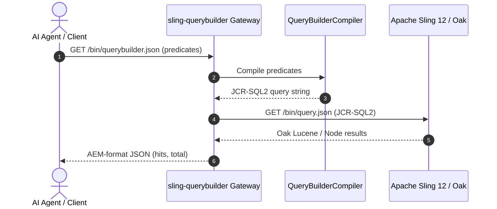

# sling-querybuilder

[](LICENSE)
[](https://www.python.org/)
[](https://github.com/fabidi/sling-querybuilder/actions/workflows/ci.yml)
[]()

> **The first open-source QueryBuilder to JCR-SQL2 compiler and runtime gateway for Apache Sling & Jackrabbit Oak.**

---

## The Missing Link in the Sling / AEM Ecosystem

For over 14 years, developers, QA engineers, and automated tools working in the Adobe Experience Manager (AEM) ecosystem have faced a fundamental divide:

1. **AEM QueryBuilder (`/bin/querybuilder.json`)** is proprietary (`com.day.cq.search.QueryBuilder`).
2. **Apache Sling & Jackrabbit Oak** are 100% open-source, but only expose `/bin/query.json` using **JCR-SQL2** or XPath.

Because of this gap, anyone building integration tests, automated migration tools, or Agentic AI MCP servers had only two choices: pay for full enterprise AEM licenses, or write complex custom Java OSGi bundles.

**`sling-querybuilder` solves this problem with zero runtime dependencies.** It compiles standard AEM QueryBuilder predicate maps into valid JCR-SQL2 and provides a drop-in HTTP gateway proxy that brings `/bin/querybuilder.json` to vanilla Apache Sling instances.

---

## Architecture



---

## Features

- **Pure Python Compiler:** Zero third-party runtime dependencies. Uses standard Python 3.11+ library.
- **Full Predicate Support:**
  - Node types (`type=cq:Page`, `type=dam:Asset`, etc.)
  - Hierarchy & path filters (`path`, `path.flat`, `path.self`, `path.exact`)
  - Property evaluation (`property`, `1_property`, `2_property` with `equals`, `unequals`, `like`, `exists`, `not`)
  - Fulltext search (`fulltext`, `fulltext.relPath`)
  - Date ranges (`daterange.property`, `lowerBound`, `upperBound`)
  - Tag queries (`tagid`, `tagid.property`)
  - Sorting & ordering (`orderby`, `orderby.sort=asc|desc`)
  - Pagination (`p.limit`, `p.offset`, unlimited `-1`)
- **Drop-in HTTP Gateway:** Listens on `/bin/querybuilder.json`, forwards queries to Sling `/bin/query.json`, and reshapes responses to match AEM's exact payload structure (`success`, `results`, `total`, `offset`, `hits`).
- **Oak EXPLAIN Query Planning:** Evaluate query execution plans (`p.explain=true` or `--explain`), detecting whether Oak will use Lucene, Property indexes, or dangerous unindexed repository traversals.
- **Oak Index Definition Generator:** Programmatically produce enterprise `/oak:index` definitions (`OakPropertyIndex`, `OakLuceneIndex`) serialized to Adobe FileVault XML (`_oak_index/.content.xml`), Apache Sling Repoinit DDL, or JSON.
- **CLI Utility:** Instantly compile queries, inspect Oak execution plans, generate index configurations, or launch the HTTP gateway proxy.
- **Docker Compose Ready:** Out-of-the-box harness to launch `apache/sling:12`.

---

## Quickstart

### 1. Installation

```bash
pip install sling-querybuilder
```

Or using `uv`:
```bash
uv pip install sling-querybuilder
```

### 2. CLI Usage

#### Compile QueryBuilder to JCR-SQL2:
```bash
sling-querybuilder compile "path=/content/novaria&type=cq:Page&1_property=jcr:content/active&1_property.value=true&p.limit=20"
```

**Output:**
```sql
--- Compiled JCR-SQL2 ---
SELECT [n].* FROM [cq:Page] AS [n] WHERE ISDESCENDANTNODE([n], '/content/novaria') AND [n].[jcr:content/active] = 'true'
--- Metadata ---
Limit:  20
Offset: 0
```

#### Explain Oak Query Plan:
```bash
# Compile and show Oak EXPLAIN SQL-2
sling-querybuilder explain "path=/content/novaria&type=cq:Page&1_property=jcr:content/active&1_property.value=true"

# Or execute EXPLAIN against live Sling to check index plan vs traversal:
sling-querybuilder explain "path=/content/novaria&type=cq:Page" --execute --sling-url http://localhost:8080 -u admin -p admin
```

#### Generate Oak Index Definitions:
```bash
# Generate PropertyIndex in Adobe FileVault XML format:
sling-querybuilder index-def --name hotelIdIdx --properties hotelId --declaring-types cq:Page --format filevault

# Generate Lucene fulltext index in Apache Sling Repoinit DDL:
sling-querybuilder index-def --name customLucene --type lucene --properties jcr:title,description --compat-version 2 --format repoinit

# Generate Lucene index in JSON:
sling-querybuilder index-def --name customLucene --type lucene --properties jcr:title,jcr:description --format json
```

#### Launch the HTTP Gateway:
```bash
# Target local Apache Sling
sling-querybuilder gateway --sling-url http://localhost:8080 --port 8081

# Or target a remote/secondary Docker host
sling-querybuilder gateway --sling-url http://10.0.0.142:8080 --port 8081
```

Now you can send standard QueryBuilder requests directly to `http://localhost:8081/bin/querybuilder.json`!

### 3. Python Library Usage

```python
from sling_querybuilder import QueryBuilderCompiler, compile_query

# Option A: Convenience function
compiled = compile_query({
    "path": "/content/dam",
    "type": "dam:Asset",
    "1_property": "jcr:content/metadata/dc:format",
    "1_property.value": "image/jpeg",
    "orderby": "@jcr:content/jcr:lastModified",
    "orderby.sort": "desc",
    "p.limit": "50"
})

print(compiled.sql2)
# SELECT [n].* FROM [dam:Asset] AS [n] WHERE ISDESCENDANTNODE([n], '/content/dam') AND [n].[jcr:content/metadata/dc:format] = 'image/jpeg' ORDER BY [n].[jcr:content/jcr:lastModified] DESC

# Option B: Parse from URL query string
compiler = QueryBuilderCompiler.from_query_string("path=/content/site&type=cq:Page")
compiled = compiler.compile()

# Option C: Oak Index Generation
from sling_querybuilder import OakPropertyIndex, OakLuceneIndex

# Generate a Property Index definition
prop_idx = OakPropertyIndex(
    name="hotelIdIdx",
    property_names=["hotelId"],
    declaring_node_types=["cq:Page"],
    unique=True
)
xml_content = prop_idx.to_filevault_xml()  # Adobe FileVault XML for /oak:index
repoinit_ddl = prop_idx.to_repoinit()       # Sling Repoinit DDL
```

---

## Predicate Mapping Matrix

| AEM QueryBuilder Predicate | JCR-SQL2 Translation |
|---|---|
| `type=cq:Page` | `SELECT [n].* FROM [cq:Page] AS [n]` |
| *(no type specified)* | `SELECT [n].* FROM [nt:base] AS [n]` |
| `path=/content/site` | `ISDESCENDANTNODE([n], '/content/site')` |
| `path=/content/site&path.flat=true` | `ISCHILDNODE([n], '/content/site')` |
| `path=/content/site&path.self=true` | `(ISDESCENDANTNODE([n], '/content/site') OR ISSAMENODE([n], '/content/site'))` |
| `path=/content/site&path.exact=true` | `ISSAMENODE([n], '/content/site')` |
| `property=jcr:title&property.value=Home` | `[n].[jcr:title] = 'Home'` |
| `property=status&property.operation=unequals&property.value=archived` | `[n].[status] <> 'archived'` |
| `property=jcr:title&property.operation=like&property.value=%Grand%` | `[n].[jcr:title] LIKE '%Grand%'` |
| `property=cq:lastModified&property.operation=exists` | `[n].[cq:lastModified] IS NOT NULL` |
| `property=cq:lastModified&property.operation=not` | `[n].[cq:lastModified] IS NULL` |
| `fulltext=luxury resort` | `CONTAINS([n].*, 'luxury resort')` |
| `nodename=hotel*` | `NAME([n]) LIKE 'hotel%'` |
| `1_path=/content/us&2_path=/content/eu` | `(ISDESCENDANTNODE([n], '/content/us') OR ISDESCENDANTNODE([n], '/content/eu'))` |
| `property=price&property.operation=<&property.value=200` | `[n].[price] < '200'` |
| `property=rooms&property.operation=>=&property.value=100` | `[n].[rooms] >= '100'` |
| `1_group.p.or=true&1_group.1_property=...&1_group.2_property=...` | `([n].[prop1] = 'val1' OR [n].[prop2] = 'val2')` |
| `orderby=@jcr:content/cq:lastModified&orderby.sort=desc` | `ORDER BY [n].[jcr:content/cq:lastModified] DESC` |

---

## Running with Docker Compose

To test with a live Apache Sling 12 container:

```bash
docker compose up -d
```

> **Tip (Secondary Docker Host Offloading):** If you run Docker on a secondary desktop or server (e.g. `desktop-server` / `10.0.0.142`) to preserve your laptop's memory:
> ```bash
> docker --context desktop-server compose up -d
> sling-querybuilder gateway --sling-url http://10.0.0.142:8080 --port 8081
> ```

Verify Sling product info:
```bash
curl -u admin:admin http://localhost:8080/system/console/status-productinfo.json
```

---

## Integration with `aem-mcp-starter-kit`

When developing Agentic AI workflows with [`aem-mcp-starter-kit`](https://github.com/fabidi/aem-mcp-starter-kit):

1. Spin up Apache Sling 12 in Docker (`docker compose up -d`).
2. Start `sling-querybuilder gateway --sling-url http://localhost:8080 --port 8081`.
3. Configure `AEM_BASE_URL=http://localhost:8081` and `AEM_MODE=onprem` in your MCP client.
4. Your AI agent can now issue standard QueryBuilder queries against open-source Apache Sling without modifying any MCP tool code!

---

## Testing

Run the full pytest suite:

```bash
pytest tests/ -v
```

---

## License

This project is licensed under the [Apache License, Version 2.0](LICENSE).
